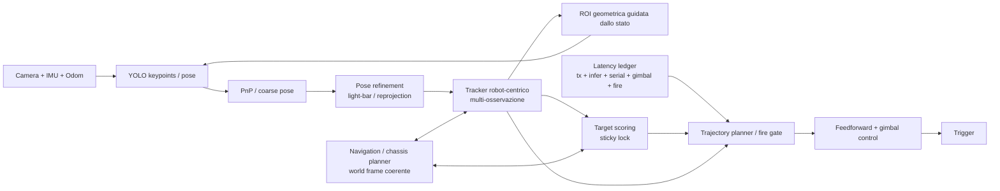
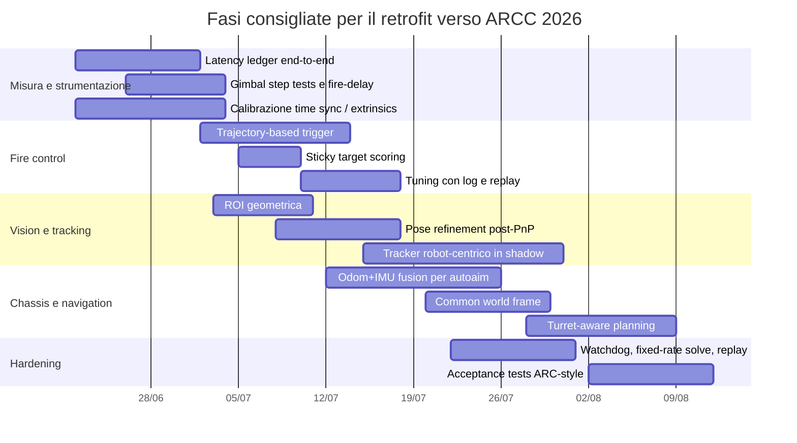

# Differenze operative tra la vostra pipeline e le pratiche cinesi rilevanti per ARCC 2026

## Sintesi esecutiva

Ho prima inquadrato **ARCC 2026** dalle fonti ufficiali: l’ARC Championship è definito come una competizione di **tactical combat** con tre eventi, **1v1**, **3v3** ed **Engineering Challenge**; la pagina ufficiale dei manuali 2026 elenca **Participant Manual v1.5**, **Events Manual v1.6**, **Robot Building Specifications v1.3.1** e **Site Manual v2.0**, e rimanda inoltre ai manuali RoboMaster per le parti regolamentari di base. La pagina di registrazione 2026 conferma gli eventi 1v1/3v3 e il contesto di uso di **projectiles**, **armor plates** e relativi strumenti di gara. Il regolamento RoboMaster 2026, lato DJI, conferma che il nucleo della gara è lo scontro tattico con robot che **sparano proiettili** contro robot e base avversaria in arena. Per questo confronto ha senso escludere ciò che non trasferisce direttamente ad ARCC 2026, come rune, outpost e meccaniche non centrali per il combattimento mobile-autonomo. citeturn32view0turn1view0turn33view0turn35view0

La conclusione pratica è netta: **la vostra pipeline non è indietro sulla famiglia di detector**, ma è superabile da molte pipeline cinesi 2024–2026 soprattutto in quattro punti: **decisione di sparo** non più basata su una semplice fire window istantanea ma su coerenza/feasibility della traiettoria; **tracking più ricco del target**, spesso robot-centrico e con update nello spazio immagine; **modellazione della latenza** più scomposta e calibrata; **integrazione più stretta con navigazione e ingegneria di sistema**. Le fonti pubbliche recenti mostrano convergenza su YOLO-family, keypoint/pose, ROI geometriche, EKF/vehicle-state tracking, controllo con feedforward e pipeline ROS2 o comunque modulari; il vantaggio competitivo non sta tanto nel “cambiare detector”, quanto nel chiudere meglio il loop decisione–controllo–temporizzazione. citeturn18search1turn16view1turn13view4turn15view3turn21view0turn37search0

C’è anche una correzione importante rispetto all’ipotesi iniziale. **Nelle sorgenti pubbliche che ho trovato non vedo una diffusione forte di modelli esplicitamente probabilistici di hit probability o di veri sistemi multi-hypothesis tracking completi** come dominante del 2024–2026. Vedo invece, molto più spesso, una migrazione verso: decisione di sparo su **overlap tra traiettoria di tiro e traiettoria eseguibile dal gimbal**, **sticky target selection**, soglie e funzioni empiriche dipendenti da RPM/ritardi, e tracking robot-centrico con più osservazioni. In altre parole, il vantaggio cinese pubblico oggi è soprattutto **ingegneristico e di integrazione**, non “magicamente probabilistico”. citeturn26search6turn15view3turn13view4turn28view0

Se dovessi scegliere tre mosse da fare subito per ARCC 2026 sulla vostra architettura attuale **YOLO keypoints → PnP → EKF 9D spin tracker → ballistic solver → latency compensation → fire window**, sceglierei in quest’ordine: **sostituzione della fire window con una decisione basata su traiettoria futura**, **scomposizione e misura della latenza con ritardo gimbal dipendente dal movimento**, **ROI geometrica e tracking robot-centrico come secondo livello sopra l’attuale stack**. Come stima ingegneristica per ARCC, queste tre mosse hanno più probabilità di spostare davvero la percentuale di hit e il DPS efficace che non un cambio YOLO→YOLO più grande. Questa è una mia stima, non un numero dichiarato dalle squadre. citeturn26search6turn15view3turn13view4turn18search1

## Perimetro ARCC 2026 e qualità delle evidenze

Per costruire il confronto ho usato come perimetro ufficiale il fatto che ARCC 2026 è una competizione di **combattimento tattico** 1v1/3v3 con un corpus manualistico dedicato e con riferimento esplicito ai manuali RoboMaster. Quindi, rispetto alla vostra pipeline, i moduli davvero pertinenti sono: **detector/pose**, **target association e state estimation**, **ballistica**, **latency compensation**, **fire decision**, **chassis/ego-motion**, **navigation integration** e **system engineering**. Tutto ciò che è fortemente legato a elementi di gioco non trasferibili o secondari per ARCC 2026 l’ho lasciato fuori. citeturn32view0turn1view0turn33view0turn35view0

Il corpus tecnico cinese pubblico più utile e recente non è uniforme. Le fonti più informative e direttamente operative sono: i materiali 2025 di **Tongji SuperPower** sul nuovo schema di autoaim; i materiali 2025 di **USTC RoboWalker** sulla sentry navigation; il contributo 2025 di **Shenzhen BMU Beijixiong** su Sim2Real, modellazione del veicolo e unificazione dei frame; il repository 2024 di **CSU FYT**; i materiali 2024–2026 su modelli di riconoscimento di **Shenzhen University RobotPilots**, **USTB Reborn** e **Hebei SciTech Actor&Thinker**; più alcuni repository 2025 con dettagli implementativi molto chiari su pipeline, strategie di fuoco e temporizzazione. La qualità migliore è sulle **scelte architetturali** e sulle **procedure di calibrazione/integrazione**; più debole, invece, sulle metriche comparabili e sulle formule complete usate in gara reale. citeturn26search6turn31search0turn22search0turn21view0turn23search2turn16view1turn18search1turn36view0

Per questo motivo, nel seguito distinguerò sempre due livelli. Il primo è: **“cosa mostrano davvero le fonti pubbliche”**. Il secondo è: **“quanto questo dovrebbe valere per la vostra ARC 2026”**, che è una **stima ingegneristica mia**, non un dato pubblicato. È un punto importante perché sarebbe facile sovrastimare quanto i top team cinesi usino formalismi probabilistici sofisticati quando, in pubblico, mostrano molto più spesso sistemi fortemente tarati empiricamente, ma ben strumentati e molto rigorosi nelle misure. citeturn15view3turn14search0turn36view0turn37search0

## Dove i team cinesi recenti sono davvero avanti nel tiro e nel tracking

La differenza più importante rispetto alla vostra pipeline è nel passaggio **da “predizione geometrica corretta” a “decisione di sparo resa fattibile dal controllo reale”**. Il caso più netto che ho trovato è Tongji SuperPower 2025: la loro documentazione pubblica esplicita una “**trajectory view**” dell’autoaim, dove non conta solo se il target è istantaneamente nel punto giusto, ma quanto la **traiettoria del gimbal** e la **traiettoria di tiro** si sovrappongono nel tempo. Nel loro materiale affermano che questo approccio, con relativo trajectory planner, porta a un **kill time di 10 s** su un bersaglio da **300 HP**, **14 rad/s**, **2 m**; inoltre verificano la decisione di sparo guardando l’errore futuro nel tempo di fire delay, non solo l’errore istantaneo. Questo è il singolo scarto più vicino a ciò che, per voi, sostituirebbe una semplice fire window. citeturn26search6turn15view3turn39search0

Anche materiali 2025 più “pratici” confermano la stessa tendenza. Il repository **Z_LION_AutoAim2025** spezza esplicitamente il sistema in livelli detector/process/controller e, nel controller, introduce **TimePredictor**, **ShootStrategy**, strategie diverse per target quasi traslanti, target seguibili e target ad altissima RPM, più una definizione della previsione temporale che somma **tempo di volo + ritardo seriale + ritardo di sparo + ritardo software**. Non è un modello bayesiano di hit probability, ma funzionalmente va nella stessa direzione: **non sparare quando l’errore è piccolo; sparare quando la traiettoria e il profilo dinamico del gimbal lo rendono realmente eseguibile**. citeturn36view0

Sul tracking, la pratica cinese più interessante non è più il classico “armor-centric PnP then EKF” puro. Il repository **WUST-RM/awakening** descrive una stima di stato “**整车**”, cioè **robot-centrica**, in cui lo stato genera le armors e le osservazioni vengono aggiornate **direttamente nello spazio immagine** tramite errore di riproiezione, usando sia armor complete sia singole light bar. È una differenza qualitativa importante dalla vostra sequenza YOLO-keypoints → PnP → EKF: nel caso WUST il PnP resta come inizializzazione/coarse pose, ma il vincolo forte è spostato nel modello di osservazione del veicolo. Questo aumenta l’utilizzo delle osservazioni, rende più stabile il face switching e migliora robustezza a occlusioni e lunga distanza. citeturn13view4

Su **ω** e **ω̇** la situazione pubblica è meno “avanzata” di quanto spesso si racconti. Le sorgenti che ho trovato esplicitano quasi sempre **yaw** e **yaw rate** nello stato; non mostrano con frequenza comparabile un uso sistematico e diffuso di **ω̇** come stato separato nell’autoaim pubblico 2024–2026. Z_LION dichiara uno stato del veicolo con **x, y, z, yaw, vx, vy, vz, vyaw**; le fonti Tongji 2025 ragionano molto di più sull’**accelerazione massima del gimbal** e sulla pianificazione della traiettoria che non su un’esplicita accelerazione angolare del bersaglio; WUST insiste su processo, associazione e osservazione multi-feature. Quindi, se cerchi il delta reale da importare in ARC, io non inseguirei per prima cosa un modello con ω̇. Metterei prima **robot-centric update**, **trajectory planning** e **delay-aware firing**. citeturn36view0turn14search0turn13view4

Anche sul **multi-hypothesis tracking** conviene essere precisi: nelle fonti pubbliche recenti io vedo soprattutto **single-hypothesis tracking ben ingegnerizzato**, con gating, matching e, al massimo, alternative come **particle filter** esplorate come opzione. Il repository FYT 2024 segnala l’aggiunta di un **particle filter** come nuova scelta per lo state estimation; WUST documenta matching greedy con gating e update multi-osservazione; non ho trovato, come tratto dominante delle release pubbliche 2024–2026, un MHT pieno stile radar/air-defense. Per ARCC 2026 questo è persino rassicurante: il salto che vi serve è più realistico da implementare. citeturn21view0turn13view4

La tabella seguente riassume il delta più importante per la vostra pipeline.

| Voce | Approccio cinese tipico 2024–2026 | Differenza rispetto a voi | Beneficio atteso per ARCC 2026 | Complessità | Dati/strumenti necessari | Adattamento concreto alla vostra pipeline |
|---|---|---|---|---|---|---|
| Decisione di sparo | Trajectory-based fire decision: overlap tra traiettoria di tiro e traiettoria realmente seguibile dal gimbal; future check sul fire delay; valutazione anche in termini di DPS/kill time, non solo errore istantaneo. citeturn26search6turn15view3turn36view0 | Voi avete già predizione, ballistica e latency compensation, ma restate concettualmente vicini a una **fire window**. | **Molto alto**. Stima mia: miglioramento più probabile su hit rate effettivo e riduzione dei colpi sprecati, soprattutto contro spin medio-alto. | Media | Log con timestamp immagine, stato EKF, comandi gimbal, colpi sparati, hit/miss o video annotato. | Tenere il vostro EKF 9D e il ballistic solver; sostituire il gate booleano con un punteggio futuro su orizzonte 50–150 ms che usi: errore previsto, saturazione dinamica del gimbal, dwell time previsto, fire delay. |
| Tracking / target modeling | Stato **robot-centrico** con osservazioni multiple; PnP come coarse pose, update finale nello spazio immagine con errore di riproiezione, uso anche di light bars isolate. citeturn13view4 | Voi siete ancora “keypoints → PnP → EKF”. | **Alto**. Stima mia: soprattutto continuità di tracking, robustezza su occlusione e face-switch. | Alta | Dataset o log con keypoint/light bars, calibrazione camera accurata, geometria robot/armor, time sync. | Tenere l’attuale pipeline come fallback; aggiungere un secondo estimatore robot-centrico che si attiva dopo lock stabile e usa le osservazioni immagine come update principale. |
| Spin modeling | Stato con yaw e vyaw è pubblico e comune; gestione dei target rotanti soprattutto via selezione strategia, planning e gating. Evidenza pubblica forte per ω, debole per ω̇ esplicito. citeturn36view0turn14search0turn13view4 | Voi avete già uno spin tracker 9D: qui non siete indietro in modo strutturale. | **Medio** se il vostro spin tracker è già stabile; **basso** come priorità prima di altre migliorie. | Media | Log target rotanti con switch di armor e cambi RPM. | Prima migliorare la parte decision/control; solo dopo valutare un modello con ω̇ o adaptive process noise. |
| Multi-hypothesis | Pubblicamente non emerge come standard dominante; più comuni single-hypothesis ben gated e, in alcuni stack, particle filter come alternativa. citeturn21view0turn13view4 | Voi non avete un gap urgente qui. | **Basso–medio** per ARCC, salvo scene molto affollate o pesanti occlusioni. | Alta | Dataset con occlusioni dure, falsi positivi e target multipli. | Rimandare; investire prima in robot-centric update e target scoring sticky. |
| Multi-target prioritization | Nelle sorgenti pubbliche recenti compaiono **scoring systems**, sticky lock, e selezione del target migliore in base a distanza/angolo/area o strategia. Non sempre viene pubblicata una funzione completa da top team, ma la tendenza è netta. citeturn28view0turn11view0 | Se oggi scegliete “quello visto meglio/prima/più vicino”, siete sotto il livello cinese medio recente. | **Medio–alto** in 3v3, più moderato in 1v1. | Bassa–media | Target metadata, distanza, visibility proxy, class/ID se disponibile, hysteresis tuning. | Introdurre uno score con sticky hysteresis: distance, angular velocity cost, visibility, predicted dwell time, current lock bonus. |

## Visione, latenza e compensazione del moto proprio

Sul versante **vision**, le pratiche cinesi recenti confermano che restare su YOLO/keypoints non è un problema di per sé. Il cambiamento vero è nell’**ottimizzazione del detector per il sensore reale e per il contesto di tracking**. Il materiale 2026 di **Hebei SciTech Actor&Thinker** apre un modello **YOLO26n-Pose** per armor detection con varianti di attenzione e due risoluzioni; la motivazione pratica è molto interessante: con input **576×768** una camera **1440×1080** richiede solo un resize, evitando il letterbox e quindi spreco di banda e compute. Già nel 2024 **USTB Reborn** distribuiva inferenza C++ con **OpenVINO puro CPU** e classificatore numerico separato. Queste scelte dicono una cosa semplice: le squadre cinesi pubbliche non stanno solo cambiando backbone, stanno **adattando il backbone al sensore, alla deployment chain e alla forma dell’immagine**. citeturn18search1turn7search0turn16view1

Ancora più interessante per voi è la combinazione tra deep model e **refinement geometrico locale**. In Z_LION 2025 il detector usa un approccio ibrido: prima ottiene punti dell’armor via rete, poi usa **ROI locali sulle two sides/light bars** per migliorare la precisione; inoltre nel solver dichiarano che una loro stima dell’orientazione ricavata geometricamente può risultare più affidabile del PnP in certi casi lontani o ambigui. Nel repository FYT 2024 compaiono anche riferimenti a **yaw-angle optimization con g2o**, **BA optimization**, riscrittura della logica PnP e frequenza di solve fissata da timer. Traduzione pratica: nelle pipeline cinesi recenti il PnP spesso **non è il punto finale della posa**, ma un passaggio raffinato o vincolato da altri elementi. citeturn36view0turn21view0

Sulla **latenza**, il progresso pubblico è più chiaro che sulle architetture di rete. Tongji 2025 decomprime il prediction time in **image transmission**, **image processing**, **communication delay** e **lower-level control delay**, e dichiara di aver trattato empiricamente il residuo come parametro di tuning, stimato attorno a **15 ms** oltre alla parte direttamente misurabile. Z_LION 2025, in parallelo, definisce il prediction time come somma di **tempo di volo + ritardo seriale + ritardo di sparo + ritardo software** e sottolinea che la cosa davvero tossica non è tanto il ritardo grande in sé, quanto la **varianza temporale**: è la dispersione del ritardo che distrugge l’hit rate sui target ad alta RPM. Questa è una lezione importante per ARCC 2026: se avete già latency compensation, il passo successivo non è “aggiungere più millisecondi medi”, ma **stimare e ridurre la variance budget**. citeturn15view3turn36view0

Per il **ritardo del gimbal come funzione dell’angolo** o LUT angolo-dipendenti, le prove pubbliche sono più indirette ma reali. Tongji lega il planning alla **massima accelerazione del gimbal**, calcolata a partire da **torque del motore** e **inerzia identificata**; Z_LION dichiara di costruire funzioni empiriche tramite test brutali su diversi regimi di rincorsa/follow angle e RPM; in entrambi i casi il messaggio è chiaro: il gimbal non viene trattato come un blocco istantaneo a ritardo costante. Non ho trovato una pubblicazione pubblica che mostri apertamente una LUT 2D completa “Δyaw, Δpitch → settle time”, ma la direzione delle release pubbliche è compatibile con esattamente quel tipo di modello. citeturn14search0turn15view3turn36view0

L’**ego-motion compensation** è il punto dove, a mio giudizio, avete il miglior rapporto impatto/sforzo dopo il fire-decision update. Le fonti pubbliche mostrano che questo tema esiste e pesa: Tongji dice esplicitamente che il loro autoaim 2025 **non considera ancora il proprio moto** e che, in casi di corsa e ingaggio, le prime raffiche risultano imprecise; dichiarano come evoluzione prevista l’introduzione della **wheel odometry**. Parallelamente, gli stack cinesi più strutturati hanno già **moduli di localization/navigation/decision** separati ma integrati: FYT 2024 espone localization, navigation e decision nel progetto visione; i lavori di BMU Beijixiong insistono sul fatto che separare troppo autoaim e navigation in due TF trees rende difficile usare trasformazioni coerenti ad alta frequenza e impedisce comportamenti di inseguimento/联动; USTC RoboWalker 2025 presenta una sentry navigation framework basata su ROS2. Questo suggerisce una lettura onesta: **nell’autoaim puro da infantry non è ancora universalmente “risolto”, ma nelle architetture cinesi forti il moto proprio è già un’informazione di sistema, non un dettaglio locale del detector**. citeturn15view3turn21view0turn22search0turn23search8turn31search2

La sintesi operativa è nella tabella seguente.

| Voce | Approccio cinese tipico 2024–2026 | Differenza rispetto a voi | Beneficio atteso per ARCC 2026 | Complessità | Dati/strumenti necessari | Adattamento concreto alla vostra pipeline |
|---|---|---|---|---|---|---|
| Detector / backbone | YOLO-family ancora dominante; varianti pose/keypoint; deployment adattato a CPU/OpenVINO, NPU/ONNX, aspect ratio camera-specifica. citeturn18search1turn16view1turn7search0 | Voi non siete “obsoleti” se già usate YOLO keypoints. | **Basso** come priorità di architettura; **medio** come deployment tuning. | Bassa–media | Benchmark per camera reale, fps per piattaforma, profili di aspect ratio. | Non cambiare subito detector; prima ottimizzare input size, no-letterbox quando possibile e pipeline di deployment. |
| Pose refinement | PnP spesso raffinato con light-bar ROI, yaw optimization, BA/graph optimization o stime geometriche locali. citeturn36view0turn21view0 | Se oggi vi fermate al PnP puro, qui avete margine reale. | **Medio** soprattutto a medio-lunga distanza o con orientazioni ambigue. | Media | Log di keypoint/light bar, calibrazione accurata, target geometry. | Aggiungere refinement dopo PnP: ROI locali sulle barre, yaw refinement, check di riproiezione e scelta robusta della soluzione. |
| ROI geometrica / focus | ROI esplicita guidata dallo stato del veicolo, per ridurre letterbox, fondo inutile e perdere meno target lontani. citeturn13view4 | Molto diversa se oggi fate full-frame costante. | **Medio–alto** come quick win: più recall lontano e meno compute sprecato. | Bassa–media | Proiezione geometrica accurata, tracker stabile, log detector. | Modalità duale: recovery full-frame, tracking stable → ROI focus. |
| Latenza componentizzata | Stima separata di transmission, inferenza/processing, seriale, controllo, fire delay; attenzione alla varianza temporale. citeturn15view3turn36view0 | Voi fate già compensation; il salto è passare da stima unica a budget misurato per componente. | **Molto alto** su target ad alta velocità angolare. | Media | Timestamp end-to-end, logger, video slow-motion, telemetria seriale. | Costruire un latency ledger per ogni frame e usare la somma reale, non una costante. |
| Ritardo gimbal / LUT | System identification di inerzia e funzioni empiriche sul follow behavior; evidenza pubblica indiretta, ma consistente. citeturn14search0turn36view0 | Probabile lacuna se oggi usate solo una costante o una dinamica troppo semplice. | **Alto** se sparate su target con grandi step angolari o spin rapidi. | Media | Step-response del gimbal a diversi Δyaw/Δpitch, batteria/temperatura, log encoder. | LUT o modello regressivo: settle time e overshoot in funzione di ampiezza e velocità richieste. |
| Ego-motion compensation | Tema emergente ma reale: wheel odom/IMU già presenti a livello sistema; autoaim infantry pubblico ancora non universalmente completo, sentry/nav molto più avanti. citeturn15view3turn21view0turn22search0turn31search2 | Se oggi non sottraete bene il moto proprio, questo è un gap concreto. | **Molto alto** per “shoot on move”; **medio** da fermi. | Media–alta | Odometria, IMU, extrinsics chassis–gimbal–camera, time sync. | Fondere odom+IMU in un chassis estimator e correggere LOS rate/relative velocity prima del ballistic solver. |

## Integrazione con navigazione e ingegneria di sistema

La differenza “cinese” che più spesso viene sottovalutata in Occidente non è il singolo algoritmo, ma il fatto che **autoaim, navigation, localization, seriale, logging e deploy vengono trattati come uno stesso sistema reale**. FYT 2024 espone un progetto con moduli separati per **autoaim, localization, perception, navigation, decision** oltre a math, logging e upstart; USTC RoboWalker 2025 pubblica esplicitamente un **navigation framework basato su ROS2** per la sentry; BMU Beijixiong 2025 sottolinea che having self-aim and navigation on two distinct TF trees rende difficile usare trasformazioni ad alta frequenza e completare comportamenti di inseguimento o coordinazione. Questo è esattamente il punto di nascita di quella che, per ARCC, io chiamerei **turret-aware planning**: non pianificare solo il movimento, ma pianificare il movimento in un frame coerente con la disponibilità reale di tiro. citeturn21view0turn31search2turn22search0turn23search8

Sul lato runtime, le release cinesi più solide insistono su pipeline e procedure, non solo su modelli. Tongji 2025 dichiara di includere **multi-thread camera driver**, protocollo elettro/comunicazione, **image–quaternion alignment**, **calibrazione intrinseca** e **hand–eye calibration**. FYT 2024 mostra logging dedicato, **watchdog/systemd service**, scelta di una **frequenza fissa di solve** via timer, e modifiche esplicite per rendere il comportamento temporale ripetibile. Un altro repository 2025 orientato 1v1/3v3 spezza il sistema in **quattro pipeline**: serial read, detect, process, serial send. Questo è molto vicino a ciò che consiglierei a voi: ridurre il numero di “misteri” temporali nel loop. citeturn37search0turn21view0turn36view0

La figura seguente mostra l’integrazione che, sulla base delle fonti, rappresenta meglio lo stato dell’arte “importabile” in ARCC 2026 senza inseguire componenti inutili.

Per la vostra pipeline, la traduzione concreta è semplice da formulare. **Non vi serve rifare tutto**. Vi serve aggiungere sopra l’attuale pipeline uno strato di: **strumentazione temporale**, **trajectory-based firing**, **state-guided ROI**, **common world frame** fra autoaim e chassis, e **deploy ripetibile** con watchdog, logging e procedure di calibrazione versionate. Le fonti pubbliche cinesi mostrano che questa disciplina di sistema è oggi parte del vantaggio competitivo quanto, e spesso più, dei singoli modelli di visione. citeturn21view0turn37search0turn36view0turn22search0

## Roadmap prioritaria per adattare la vostra pipeline ad ARCC 2026

La tabella seguente è ordinata per **rapporto impatto/sforzo** sulla vostra pipeline attuale. Le colonne **Effort** e **Impact** sono stime ingegneristiche mie per ARCC 2026.

| Priorità | Upgrade | Perché viene prima | Effort stimato | Impact stimato | Quick win concreto | Success metric da usare |
|---|---|---:|---:|---:|---|---|
| 1 | **Trajectory-based fire decision** al posto della fire window | È il delta più chiaro nelle fonti Tongji/Z-LION ed è quello che più direttamente converte tracking corretto in DPS reale. citeturn26search6turn15view3turn36view0 | 2–3 settimane | Molto alto | Tenere il vostro aimpoint; cambiare solo il trigger logic su orizzonte futuro | Hit rate su gyro; colpi sprecati; DPS effettivo |
| 2 | **Latency ledger per componente** | Le fonti pubbliche recenti insistono sul budget temporale scomposto e sulla varianza del ritardo. citeturn15view3turn36view0 | 1–2 settimane | Molto alto | Logger end-to-end con timestamp camera/infer/serial/fire | Errore predizione vs target reale; jitter del loop |
| 3 | **Gimbal delay model / LUT** | È il passaggio necessario per rendere il trajectory gate veramente fisico. citeturn14search0turn36view0 | 1–2 settimane | Alto | Test a scalino e fit di settle time/overshoot | Tempo di assestamento per Δyaw/Δpitch |
| 4 | **ROI geometrica e camera-shape aware detector input** | Quick win reale senza buttare via il detector attuale. citeturn13view4turn18search1turn7search0 | 1–2 settimane | Medio–alto | Recovery full-frame + locked ROI mode | Recall lunga distanza; infer time medio |
| 5 | **Target scoring con sticky lock** | Valore alto in 3v3; costo basso. citeturn28view0turn11view0 | 3–5 giorni | Medio–alto | Score = dwell time + distance + visibility + lock bonus | Switch rate; time-on-target; kill conversion |
| 6 | **Ego-motion compensation con odom+IMU** | Il problema è esplicito nelle fonti, e per “shoot on move” è decisivo. citeturn15view3turn22search0turn31search2 | 2–4 settimane | Alto | Correggere prima il LOS rate, poi la prediction completa | First-burst hit rate in movimento |
| 7 | **Tracker robot-centrico con update nello spazio immagine** | Upgrade architetturale forte, ma non il primo quick win. citeturn13view4 | 4–6 settimane | Alto | Modalità shadow: gira in parallelo al tracker attuale | Track continuity, face-switch stability |
| 8 | **Common world frame e turret-aware navigation** | Più importante in 3v3 e nei robot autonomi/semiautonomi mobili. citeturn22search0turn23search8turn31search2 | 3–5 settimane | Medio–alto | Planner cost che penalizza pose con scarso firing geometry | Tempo in LOS utile; engagement opportunities |
| 9 | **Esplicito ω̇ / MHT pieno** | Nelle fonti pubbliche non è il vero fattore differenziante dominante. citeturn21view0turn13view4 | 3–6 settimane | Medio–basso | Rimandare | Solo dopo aver saturato i punti 1–8 |

Questa roadmap si presta bene a una pianificazione a fasi corte. Un esempio realistico è il seguente.

Se devo essere ancora più diretto: **non vi consiglierei di ripartire da zero né di aprire subito il fronte “modello più grosso”, “ω̇”, o “MHT completo”**. Dalle evidenze pubbliche recenti, i team cinesi più convincenti stanno vincendo soprattutto perché fanno meglio di altri tre cose contemporaneamente: **misurano il tempo**, **vincolano il firing alla dinamica reale**, **trattano autoaim e navigation come sottosistemi dello stesso robot**. Per ARCC 2026, questo è esattamente il tipo di vantaggio che conviene importare. citeturn15view3turn26search6turn22search0turn37search0